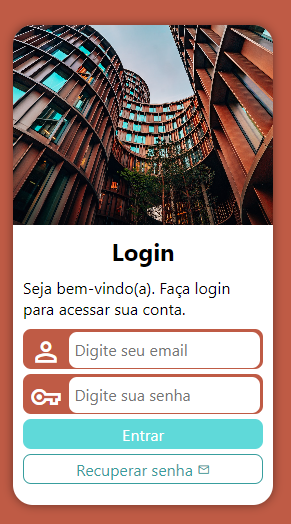
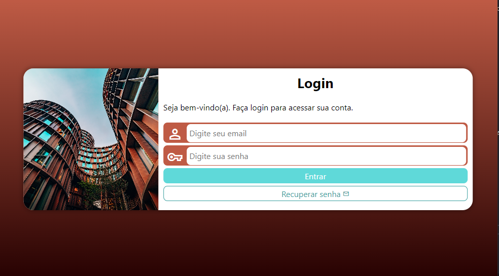
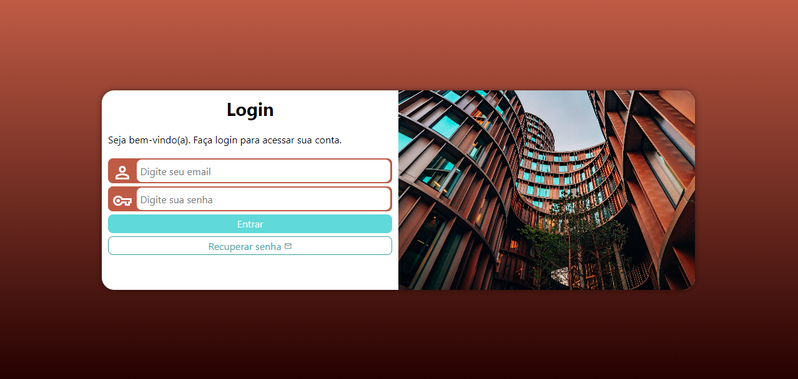

# Tela-de-login
Este é um projeto simples que consiste em uma tela de login responsiva que utiliza media queries para se adaptar a diferentes tamanhos de tela. O objetivo do projeto é praticar o uso de media queries, que é uma técnica essencial para criar layouts responsivos.

## Funcionalidades
A tela de login possui os seguintes campos:
* E-mail
* Senha

Além disso, a tela também possui um botão de "Entrar" e um link para recuperar a senha. A tela foi desenvolvida para se adaptar a diferentes tamanhos de tela.

## Screenshots
Abaixo estão alguns screenshots da tela de login em diferentes tamanhos de tela:
### Tela pequena

### Tela média

### Tela grande

## Tecnologias utilizadas

Copyright © DavidWillian
